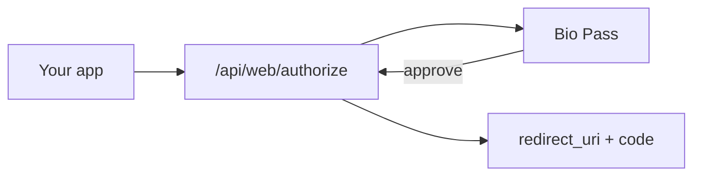

<p align="center">
  
</p>

<h1 align="center">BioPass Community</h1>

<p align="center">
  Self-hosted biometric MFA / OAuth — API + admin console.<br/>
  Approve sign-ins with the <a href="https://apps.apple.com/kr/app/bio-pass/id6760216314">Bio Pass</a> app (fingerprint / Face ID).
</p>

<p align="center">
  <a href="LICENSE"></a>
  <a href="https://apps.apple.com/kr/app/bio-pass/id6760216314"></a>
</p>

## Companion app

<p align="center">
  <a href="https://apps.apple.com/kr/app/bio-pass/id6760216314">
    
  </a>
</p>

This repo is the **server**. End users install **[Bio Pass](https://apps.apple.com/kr/app/bio-pass/id6760216314)** (App Store · iOS 15+) and approve login requests against your deployment. Google Play is not published yet.

<p align="center">
  
  
  
</p>

## Install

Needs Docker Compose v2.

```bash
git clone https://github.com/Fhwang0926/BioPass-Community.git
cd BioPass-Community
cp .env.example .env
```

Set in `.env`:

- `AUTH_SECRET` — `openssl rand -hex 32`
- `POSTGRES_PASSWORD` — strong DB password

```bash
docker compose up --build -d
# or: docker compose -f docker-compose.ghcr.yml up -d
```

Open http://localhost:3030 → `/#/setup` (first admin) → `/#/login`.

Optional: `PUBLIC_BASE_URL` (HTTPS origin), SMTP / Firebase — see [`.env.example`](.env.example). Production hardening: [SECURITY.md](SECURITY.md).

## Use

1. In the admin console, create an **Application** (client id/secret, callback URL).
2. Point clients and phones at your public HTTPS URL (`PUBLIC_BASE_URL`).
3. Users install Bio Pass, sign in with email, and approve MFA prompts (or email OTP if SMTP is set).



Stack: Node 22 + Koa + PostgreSQL · React admin (Vite). Roles: `ADMIN` / `USER` (console), `APP` (mobile). Single-organization self-host.

## Develop

```bash
docker compose up -d db
cd backend && yarn install && yarn dev    # :3030
cd frontend && pnpm install && pnpm dev # :3031 → proxies /api
```

## License

Apache-2.0 — [LICENSE](LICENSE), [NOTICE](NOTICE).  
Contribute: [CONTRIBUTING.md](CONTRIBUTING.md) · [Code of Conduct](CODE_OF_CONDUCT.md).
