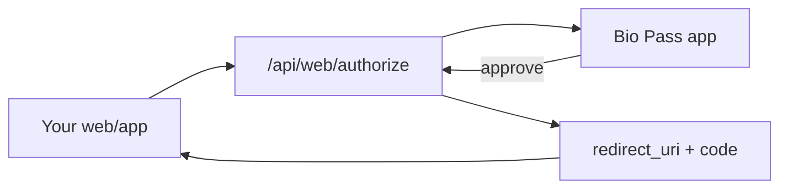

# BioPass Community

Self-hosted biometric MFA / OAuth authentication platform (community edition).

Apache License 2.0. See [LICENSE](LICENSE) and [NOTICE](NOTICE).

## Companion app — Bio Pass

End users approve login requests on their phone with fingerprint or Face ID.

| Store | Link |
|-------|------|
| **App Store (iOS)** | [Bio Pass](https://apps.apple.com/kr/app/bio-pass/id6760216314) |
| Google Play (Android) | Not published yet — set `APP_DOWNLOAD_URL_ANDROID` / `VITE_PLAY_STORE_URL` when available |

Search on the App Store: [biopass](https://apps.apple.com/kr/iphone/search?term=biopass) → **Bio Pass** (Utilities).

The mobile client talks to your self-hosted server over `/api/app` and `/api/web`. This repository ships the **server + admin console only**; the iOS app is distributed separately from the App Store.

## What's included

- **Backend**: Node.js 22+, Koa, Drizzle ORM, PostgreSQL
- **Admin console**: React + Vite (based on [slash-admin](https://github.com/d3george/slash-admin))
- **Auth UX**: Browser OAuth/email flow + deep-link / push approval via the Bio Pass app

Commercial SaaS features (plans, Polar billing, hosting console, vendor QnA/FAQ) are not part of this edition.

**Community vs commercial:** “BioPass Community” is the Apache-2.0 self-hosted edition. The name “BioPass” may also refer to related commercial offerings that are **not** included here. This repository does not grant trademark rights beyond what Apache-2.0 already allows for attribution.

## First-time installation

Prerequisites: [Docker](https://docs.docker.com/get-docker/) + Docker Compose v2.

**Stack (always):**

| Service | Role |
|---------|------|
| `db` | PostgreSQL 16 (volume `biopass_pg`) |
| `api` | BioPass API + admin UI (port **3030**) |

### Step 1 — Clone and configure

```bash
git clone https://github.com/Fhwang0926/BioPass-Community.git
cd BioPass-Community
cp .env.example .env
```

Edit `.env` and set a strong secret (Compose **refuses to start** if `AUTH_SECRET` is empty or missing):

```bash
# macOS / Linux
sed -i.bak "s/^AUTH_SECRET=.*/AUTH_SECRET=$(openssl rand -hex 32)/" .env && rm -f .env.bak

# Or append / edit manually:
# AUTH_SECRET=<paste openssl rand -hex 32 output>
```

Optional before first boot:

| Variable | When |
|----------|------|
| `PUBLIC_BASE_URL` | Not running on `http://localhost:3030` (use your HTTPS origin) |
| `INIT_ADMIN_EMAIL` + `INIT_ADMIN_PASSWORD` | Skip the browser wizard and seed the first admin automatically |
| `INIT_ADMIN_NAME` / `INIT_ADMIN_PHONE` | Optional fields for headless seed |

### Step 2 — Start the stack

**A) Build from source** (recommended until a GHCR image is published for your release):

```bash
docker compose up --build -d
```

**B) Prebuilt GHCR image** (after packages are public / tagged):

```bash
docker compose -f docker-compose.ghcr.yml up -d

# Pin a release (semver tags omit the leading v):
# IMAGE_TAG=1.0.0 docker compose -f docker-compose.ghcr.yml up -d
```

On first boot the API waits for Postgres, syncs the schema from Drizzle models (`db:push`), and is ready for setup. Check progress:

```bash
docker compose ps
docker compose logs -f api
# With GHCR compose file, prefix: docker compose -f docker-compose.ghcr.yml …
```

Health check: http://localhost:3030/ping (returns a numeric timestamp).

### Step 3 — Create the first administrator

**Browser (default):** open http://localhost:3030

| Path | Purpose |
|------|---------|
| `/#/setup` | First-run wizard — create organization admin (empty DB only) |
| `/#/login` | Sign in after setup |

An empty database redirects you to **`/#/setup`**. After the admin exists, use **`/#/login`**.

**Headless (optional):** if both `INIT_ADMIN_EMAIL` and `INIT_ADMIN_PASSWORD` were set in `.env` before start, the API seeds that admin and you can go straight to `/#/login`.

### Step 4 — Verify

```bash
curl -sS http://localhost:3030/ping
curl -sS http://localhost:3030/api/auth/setup/status
```

| Item | Value |
|------|--------|
| Admin UI + API | http://localhost:3030 (Compose binds **127.0.0.1** by default) |
| First-run setup | http://localhost:3030/#/setup |
| Health | http://localhost:3030/ping |
| Postgres (localhost only) | `127.0.0.1:5432` · user/db/password **`biopass`** (Compose defaults) |

Stop / reset:

```bash
docker compose down         # keep volumes (DB + uploads)
docker compose down -v      # wipe DB and uploads — full reinstall
```

### Production checklist

- Set a strong `AUTH_SECRET` (`openssl rand -hex 32`)
- Complete `/#/setup` with a strong password (or seed via `INIT_ADMIN_*`)
- Change `POSTGRES_PASSWORD` for non-local deploys (Compose default is `biopass`)
- Keep API on loopback (`API_HOST_BIND=127.0.0.1`) and put TLS reverse proxy in front; only set `API_HOST_BIND=0.0.0.0` if you accept direct exposure
- If not on localhost, set `PUBLIC_BASE_URL` / `CORS_ORIGINS` to your HTTPS origin
- Set `TRUST_PROXY=1` only behind a trusted reverse proxy
- For upgrades, prefer `SKIP_AUTO_SCHEMA_SYNC=1` and run schema sync deliberately; avoid `ALLOW_SCHEMA_FORCE=1` unless you accept destructive changes
- Do not expose Postgres publicly (bound to `127.0.0.1` by default)
- Optionally configure SMTP and Firebase push — see commented keys in [`.env.example`](.env.example) (Compose forwards them into the API container)
- Point phones at your public HTTPS origin (`PUBLIC_BASE_URL`) so the Bio Pass app can reach `/api/app`

## How others use a deployed instance

After you publish this stack (Docker / GHCR), other people fall into two roles.

### A) Operator (you / your org) — one-time setup

1. Deploy with Compose (or GHCR image) and open the admin UI (`/#/setup` → `/#/login`).
2. Create an **Application** in the console (client id / secret, redirect URIs, site origin).
3. Set `PUBLIC_BASE_URL` to the HTTPS URL clients and the mobile app will call.
4. Optional but recommended for production MFA UX:
   - **SMTP** — email verification codes when the user has no registered device yet
   - **Firebase** — push notifications to the Bio Pass app (`FIREBASE_SERVICE_ACCOUNT_JSON`)
5. Integrate your product with OAuth authorize / token (see admin **Developer** pages and `backend/docs/`).

### B) End user (people signing into *your* apps)

1. Install **[Bio Pass](https://apps.apple.com/kr/app/bio-pass/id6760216314)** from the App Store.
2. Open the app and sign up / sign in with **email** against *your* server (the app uses the API base you configure / that your deep links point to).
3. When they try to log into a site that uses your BioPass OAuth app:
   - Browser opens the BioPass authorize / guide page on your server
   - They get a **push** (or tap “Approve in app” / deep link `biopass://…`)
   - They approve or deny with **biometrics**
4. On success the browser receives the OAuth `code` on your `redirect_uri` as usual.

Without the mobile app, users can still complete login via **email code** when you have SMTP configured — the app is the recommended biometric path, not a hard requirement for every flow.



## Docker image (GHCR) & GitHub Actions

Images are published by [`.github/workflows/docker-publish.yml`](.github/workflows/docker-publish.yml).

| Trigger | Image tags |
|---------|------------|
| Push to `main` / `master` | `latest`, `sha-<short>`, branch name |
| Git tag `v1.2.3` | `1.2.3`, `1.2`, `sha-<short>` |
| Pull request | Build only (not pushed) |
| Manual (`workflow_dispatch`) | Same as branch push |

**Registry:** `ghcr.io/<owner>/biopass-community` (upstream default owner `fhwang0926`) · **Platforms:** `linux/amd64`, `linux/arm64`

Forks: set `BIOPASS_IMAGE=ghcr.io/<your-owner>/biopass-community` in `.env` when using `docker-compose.ghcr.yml`.

### Make the package public (one-time)

1. Repo → **Packages** → `biopass-community`
2. **Package settings** → **Change visibility** → **Public**

### Publish a versioned release

```bash
git tag v1.0.0
git push origin v1.0.0
# Then: IMAGE_TAG=1.0.0 docker compose -f docker-compose.ghcr.yml up -d
```

> `docker/metadata-action` strips the leading `v` from semver tags (`v1.0.0` → `1.0.0`).

### Related files

| File | Role |
|------|------|
| [`Dockerfile`](Dockerfile) | Multi-stage API + admin UI image (frontend is baked into `wwwroot`) |
| [`docker-compose.yml`](docker-compose.yml) | Postgres + build API image |
| [`docker-compose.ghcr.yml`](docker-compose.ghcr.yml) | Postgres + pull GHCR API image |
| [`.env.example`](.env.example) | Single env sample (`AUTH_SECRET`, optional `PUBLIC_BASE_URL` / `INIT_ADMIN_*`) |
| [`.github/workflows/docker-publish.yml`](.github/workflows/docker-publish.yml) | Build/push to GHCR |

## Local development

```bash
# 1) Postgres only
docker compose up -d db

# 2) Backend (canonical lockfile: yarn.lock)
#    Uses repo-root .env for AUTH_SECRET; DATABASE_URL defaults to local biopass
cd backend && yarn install
yarn db:push                 # optional — also runs automatically on server start
yarn dev                     # http://localhost:3030

# 3) Frontend (canonical: pnpm@9.1.0)
cd frontend && pnpm install
pnpm dev                     # http://localhost:3031 — proxies /api → :3030
```

Root helpers (run against `backend/`):

```bash
npm run dev
npm run db:push
```

## Project layout

```
BioPass-Community/
├── backend/                  # API server (Koa + Drizzle + Postgres)
├── frontend/                 # Admin dashboard (Vite + React)
├── .github/
│   ├── workflows/            # GHCR Docker publish
│   └── ISSUE_TEMPLATE/       # Bug / feature / docs forms
├── docker-compose.yml
├── docker-compose.ghcr.yml
├── Dockerfile
├── .env.example
├── CODE_OF_CONDUCT.md
├── CONTRIBUTING.md
├── SECURITY.md
├── LICENSE
└── NOTICE
```

## Roles (community)

Single-organization self-host — there is no platform / multi-tenant super-admin role.

| Role | Typical use |
|------|-------------|
| `ADMIN` | Organization admin (created via `/#/setup` or invite). Full console access within their company. |
| `USER` | Console user with limited access |
| `APP` | Mobile end-user identity (Bio Pass app) — not a console login role |

Legacy DB value `SUPER_ADMIN` (if present) is treated as `ADMIN` on read.

## Security notes

- Set a strong `AUTH_SECRET` before any public deployment
- Use a strong password in `/#/setup` (or for `INIT_ADMIN_*` if seeding)
- Do not commit `backend/.env`, Firebase service-account JSON, or OAuth client secrets
- Report vulnerabilities privately — see [SECURITY.md](SECURITY.md)

## Contributing

See [CONTRIBUTING.md](CONTRIBUTING.md). Please follow the [Code of Conduct](CODE_OF_CONDUCT.md).

## License

Apache License 2.0 — [LICENSE](LICENSE). Third-party notices (including slash-admin MIT): [NOTICE](NOTICE).
