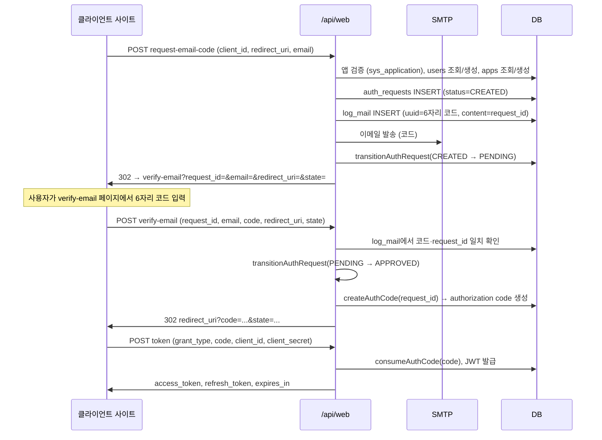
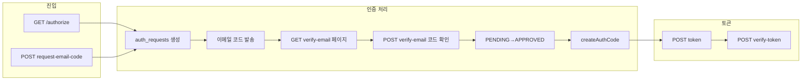

# backend/api/service

웹·앱 연동 API. **`web/`** 는 웹 브라우저/이메일 기반 OAuth·인증 플로우, **`app/`** 는 안드로이드/iOS 앱에서 요청하는 API를 제공합니다.

---

# Web API 동작 플로우 (`api/service/web/`)

## 권장 연동 구조 (프론트 → 자체 백엔드 → Bio-Pass)

1. **프론트엔드**: 로그인 버튼 → `GET https://your-site.com/api/auth/login` (client_id·client_secret 노출 없음)
2. **자체 백엔드**: 환경변수의 `client_id`, `redirect_uri`(백엔드 콜백 URL)로 `GET /api/web/authorize` 리다이렉트
3. **Bio-Pass**: 인증 완료 후 `redirect_uri?code=...&state=...` (백엔드로만 전달)
4. **자체 백엔드**: `POST /api/web/token` (client_secret 서버에서만) → 세션 생성 → 프론트로 리다이렉트

앱 Callback URL에는 **프론트 페이지가 아닌 백엔드 엔드포인트**(예: `https://your-site.com/api/auth/callback`)를 등록하세요.

---

## 1. 엔드포인트 목록 (prefix: `/api/web`)

| 메서드 | 경로 | 용도 |
|--------|------|------|
| POST | `/request-email-code` | 이메일 인증 코드 요청 (auth 폼 전용, 코드 발송 후 verify-email로 리다이렉트) |
| POST | `/resend-email-code` | 이메일 인증 코드 재발송 |
| GET | `/authorize` | OAuth 2.0 인증 요청 (client_id, redirect_uri, email/phone 등에 따라 분기) |
| GET | `/guide` | 앱 설치·가이드·인증 방법 HTML |
| GET | `/guide/images/:name` | 가이드 이미지 (step1.svg 등) |
| GET | `/verify-email` | 이메일 인증 코드 입력 페이지 (HTML) |
| POST | `/verify-email` | 이메일 인증 코드 확인 → 인증 완료 후 redirect_uri?code=... 리다이렉트 |
| POST | `/auth-request-status` | 모바일 승인 대기 중 브라우저 폴링 (APPROVED 시 redirect_url 반환) |
| POST | `/notify-auth-request` | 등록 기기로 push 알림 재전송 |
| POST | `/token` | OAuth 2.0 토큰 교환 (code → access_token, refresh_token) |
| POST | `/verify-token` | 토큰 검증 (token + client_id + client_secret → 사용자 정보) |

---

## 2. 주요 플로우

### 2-1. 이메일 인증 경로 (폼에서 시작)

클라이언트 사이트가 **이메일 입력 폼**을 제공하고, 사용자가 이메일을 입력한 뒤 `POST /api/web/request-email-code`를 호출하는 경로.



- **request-email-code**: `client_id`, `redirect_uri`, `email` 필수. 앱 검증 후 인증 요청 생성 → 이메일로 6자리 코드 발송 → **CREATED → PENDING** 전이 → `verify-email` URL로 리다이렉트(또는 JSON으로 `verify_url` 반환).
- **verify-email (GET)**: `request_id`, `email`, `redirect_uri`, `state`, `app_name` 쿼리로 코드 입력 페이지(HTML) 표시.
- **verify-email (POST)**: 6자리 `code`와 `log_mail`(uuid, content=request_id) 일치 검사 → **PENDING → APPROVED** 전이 → `createAuthCode()`로 authorization code 생성 → `redirect_uri?code=...&state=...` 리다이렉트(또는 JSON `redirect_url`).
- **token**: `code`로 authorization code 소비 후 JWT(access_token, refresh_token) 반환.

### 2-2. GET /authorize 경로 (쿼리에 email/phone 있을 때)

클라이언트가 **GET /api/web/authorize?client_id=...&redirect_uri=...&response_type=code&email=...** (또는 phone)으로 호출하는 경로.

**공통 선행 조건**: `redirect_uri`는 `sys_application.callback_url`과 **문자 그대로 일치**해야 합니다. 불일치 시 HTML 오류 페이지가 표시되며 이메일·기기 분기는 실행되지 않습니다.

- **전화번호로 사용자 식별 성공** (이미 등록된 phone, push 기기 있음):  
  인증 요청 생성 → **CREATED → PENDING** → push 전송 → `redirect_uri?request_id=...&redirect_uri=...&state=...&scope=...` 로 리다이렉트.
- **email 쿼리 포함**:
  - **push 기기 있음**: 인증 요청 생성 → 자동 push 전송 → **모바일 알림 확인 HTML** 표시. 브라우저는 `POST /auth-request-status`로 승인 완료를 폴링하고, 승인 시 `redirect_uri?code=...`로 이동.
  - **push 기기 없음**: 인증 요청 생성 → **verify-email** URL로 리다이렉트(6자리 코드 이메일 발송). 앱 설치 안내 표시. (이후 verify-email POST → token과 동일.)
- **email/phone 없음**:  
  가이드 페이지(HTML) 표시. (이메일 입력 폼으로 `request-email-code` 호출 가능.)

### 2-3. 코드 재발송

- **POST /resend-email-code** (body: `request_id`, `email`, 선택 `redirect_uri`, `state`, `client_id`):
  기존 PENDING/CREATED 인증 요청 또는 해당 이메일의 미처리 코드 로그가 있어야 재발송한다. 기존 요청을 **EXPIRED** 처리 후 동일 app으로 새 인증 요청 생성 → 기존 이메일 코드 무효화 → 새 6자리 코드 발송 → CREATED → PENDING. 응답은 "새 보안 코드를 발송했습니다." 등.

### 2-4. 토큰 검증 (콜백 후)

- **POST /verify-token** (body: `token`, `client_id`, `client_secret` 또는 Authorization: Bearer):  
  client_id/client_secret으로 앱 검증, JWT 검증 후 `success`, `authenticated`, `user` (id, email, phone 등) 반환.

---

## 3. 사용 테이블/서비스

PostgreSQL 테이블명 기준 (Drizzle `app_*` / `sys_*` / `log_*`):

- **app_auth_requests**: 인증 요청 생성, 상태 전이(CREATED → PENDING → APPROVED 등).
- **app_auth_events**: `recordAuthEvent()`로 CREATED, EXPIRED_BY_RESEND, verify_email 등 이벤트 기록.
- **app_users**: 이메일/전화 해시로 사용자 조회. 웹 이메일 인증은 검증 전 placeholder를 사용하고, 코드 검증 성공 시 `web_auth` 사용자로 생성/연결한다.
- **app_sys_apps**: client_id로 앱 조회/생성, redirect_uri 저장.
- **sys_application**: client_id 검증, callback_url 일치 검사, lastAuthRequestAt 갱신.
- **log_mail**: 이메일 인증용 6자리 코드 저장(from=web_auth, uuid=코드 숫자, content=request_id), 발송 후 isClear 등 갱신.
- **service/transition.js**: `transitionAuthRequest()`(상태 전이), `createAuthCode()` / `consumeAuthCode()`(authorization code), `recordAuthEvent()`.

---

## 4. 응답 형식

- **HTML 요청** (Accept: text/html): 에러 시 `renderErrorPage()`, 가이드/verify-email 페이지는 `renderTemplate('auth.html', ...)`.
- **JSON 요청** (Accept: application/json): 성공 시 `logSuccess()` 형태 `{ result, message, data }`, 실패 시 `{ error, error_description }` 또는 `logFailure()`.  
  token은 OAuth 2.0 형식 `{ access_token, token_type, expires_in, refresh_token, scope }`.

---

## 5. 요약 다이어그램



- **공통**: 앱 검증(client_id, redirect_uri/callback_url 일치) 후 인증 요청 생성 및 상태 전이.
- **이메일 경로**: log_mail에 6자리 코드 저장 + SMTP 발송 → verify-email에서 코드 검증 → authorization code 발급 → redirect_uri?code=... → 클라이언트가 POST /token으로 토큰 교환.

이 문서는 `api/service/web/` 라우트와 `service/transition.js`, `service/audit.js` 사용을 기준으로 정리한 플로우입니다.

---

# 앱에서 처리해야 하는 플로우 (prefix: `/api/app`)

앱(Android/iOS)에서 백엔드와 연동할 때의 **요청 순서**와 **주요 기능별** 사용 방법입니다. 애플리케이션 생성/수정/삭제는 이 API에 없으며 관리 콘솔에서만 가능합니다.

---

## 1. 앱에서 요청하는 순서 플로우

### 1-1. 회원가입 (최초 사용자)

```
1. POST /api/app/signup/send-code
   body: { identifier_type: "email" | "phone", identifier_value: "..." }
   → 200: 인증 코드 발송됨. 409: 이미 가입된 식별자.

2. 사용자가 이메일/문자로 받은 6자리 코드 입력

3. POST /api/app/signup/verify
   body: { identifier_type, identifier_value, code: "123456" [, device: { platform, push_token, device_name?, biometric_capable? } ] }
   → 200: data.user_id, data.access_token, data.refresh_token, data.expires_in [, data.device] 반환.
```

- `identifier_type`: `email` 또는 `phone`.
- 이메일은 SMTP로 발송, 연락처(phone)는 현재 코드만 DB 저장(실제 SMS는 환경에 따라 별도 연동).
- 동일 식별자로 이미 가입된 경우 `send-code` / `verify` 모두 **409 already_registered**.
- **signup/verify** 성공 시 로그인과 동일하게 `access_token`, `refresh_token`을 함께 반환하므로, 앱은 이를 저장해 바로 인증 상태로 사용하면 됨. 별도 로그인 API 없음.
- **기기 등록**: body에 `device`(platform, push_token 필수, device_name·biometric_capable 선택)를 넣으면 인증 성공 시 해당 기기를 등록하고, 응답에 `data.device`(id, device_secret, platform 등)를 그대로 반환. 등록된 기기는 관리 화면 **사용자 관리 > 디바이스** 메뉴에 표시됨.

### 1-2. 셀프호스트 콘솔 디스커버리 (앱 서버 등록)

앱 첫 실행·설정에서 사용자가 입력한 콘솔 URL이 BioPass Community 서버인지 확인합니다. pairing/invite 없음.

```
GET /api/app/check-site?url=https://biopass.example.com
  또는
GET /api/app/check-site?origin=https://biopass.example.com
```

- 인증 없음. `url` 또는 `origin` 중 하나 필수.
- 유효한 URL이면 항상 `supported: true`. 응답 `data`:

| 필드 | 의미 |
|------|------|
| `supported` | 이 호스트가 BioPass 콘솔임 (`true`) |
| `url` | 요청 origin |
| `console_url` | 앱이 저장할 베이스 URL (`FRONTEND_ORIGIN` → `PUBLIC_FRONTEND_ORIGIN` → `PUBLIC_BASE_URL` → request origin) |
| `app_name` | 활성 회사명, 없으면 `BioPass` |
| `server_version` | 서버 버전 |
| `auth_mode` | 항상 `self-host-console` |

앱은 `supported === true`일 때 `console_url`(없으면 입력 URL)을 `current_server_url`로 저장한 뒤, 같은 호스트의 `signup/send-code` · `signup/verify`로 로그인합니다.

### 1-3. OAuth 인증 (웹→앱 경로: 웹에서 “앱으로 로그인” 시)

- **웹 쪽**: 브라우저가 `GET /api/web/authorize?client_id=...&redirect_uri=...&response_type=code&...` 호출.
- 서버가 인증 요청을 만들고, **redirect_uri**에 `request_id` 등을 담아 리다이렉트하거나, “앱에서 승인하기” 버튼으로 **딥링크**(`biopass://auth?request_id=...`)를 제공.
- **앱 쪽**:
  1. 딥링크 또는 푸시 알림의 `request_id` 수신.
  2. **GET /api/app/my-auth-requests**  
     Header: `Authorization: Bearer <access_token>`  
     → JWT에서 사용자 식별. 대기 중인(PENDING) 인증 요청 목록에 해당 `request_id`가 포함되는지 확인 가능.
  3. 사용자가 승인/거절 시 **POST /api/app/submit-auth-result**  
     body: `{ request_id, result: "approve" | "deny", device_id, timestamp, nonce, signature }`  
     → `signature`는 `device_secret`으로 `request_id:result:device_id:timestamp:nonce` HMAC-SHA256. 승인 시 웹은 이후 `POST /api/web/token`으로 code 교환 등 기존 OAuth 플로우 진행.

(토큰 교환은 웹/클라이언트 사이트에서 `POST /api/web/token` 사용. 앱은 인증 요청 조회·결과 제출만 담당.)

### 1-4. 앱 목록 검색 (관리/설정용, 선택)

```
POST /api/app/search
Header: Authorization: Bearer <JWT>
body: { name?, client_id?, is_active?, page?, limit? }
```
- JWT 필요. 로그인된 사용자(또는 관리용 토큰)로 등록된 애플리케이션 목록 조회. **조회 전용**, 생성/수정/삭제 없음.

---

## 2. 앱의 주요 기능별 설명

### 2-1. 최근 나의 인증 요청 및 인증 내역

| 기능 | API | 비고 |
|------|-----|------|
| **대기 중인 인증 요청** | **GET /api/app/my-auth-requests** | Header: `Authorization: Bearer <access_token>`. JWT에서 사용자 식별. 해당 사용자의 **PENDING** 요청만 반환. 만료된 PENDING은 자동으로 EXPIRED 처리 후 제외됨. |
| **승인/거절 제출** | **POST /api/app/submit-auth-result** | body: `{ request_id, result: "approve" \| "deny", device_id, timestamp, nonce, signature }`. JWT + 등록 기기 HMAC 필수. |
| **완료/거절 내역** | (없음) | 서버 API는 **대기 중인 요청**만 제공. 완료·거절·만료된 “인증 내역”은 앱에서 **로컬 저장**하거나, 승인/거절 시점에 앱이 기록해 두는 방식을 권장. |

- 앱 실행 시 또는 “인증 요청” 화면 진입 시 `my-auth-requests`를 호출해 목록을 갱신하면 됨.
- 푸시 알림 또는 딥링크로 `request_id`를 받으면, 앱에 저장된 access_token으로 `GET my-auth-requests`를 호출해 해당 요청이 포함되는지 확인한 뒤 상세 화면으로 이동하면 됨.

### 2-2. 회원가입 및 알림 수신

- **회원가입**: 위 **1-1** 순서대로 `signup/send-code` → 사용자 코드 입력 → `signup/verify`. 성공 시 `user_id`, `access_token`, `refresh_token` 반환. 앱은 토큰을 저장해 바로 로그인 상태로 사용하고, 이후 인증이 필요한 API(예: `search`) 호출 시 `Authorization: Bearer <access_token>` 사용.
- **알림 수신**:
  - 서버는 인증 요청 생성 시 **FCM 푸시**를 보낼 수 있음 (`notification.service`: `request_id`를 data에 담아 해당 user의 등록 디바이스로 전송).
  - 웹 인증 페이지의 “앱에서 승인하기”는 **딥링크**로 앱을 띄움 (`scheme://auth?request_id=...`). Android는 intent URL 형태로도 제공됨.
  - 앱은 (1) 푸시 payload의 `request_id` 또는 (2) 딥링크 쿼리의 `request_id`를 받아, `my-auth-requests`로 목록을 갱신한 뒤 해당 요청 상세 화면으로 이동하면 됨.

### 2-3. 마이페이지 (로그아웃, 버전 정보 등)

| 항목 | 처리 방법 |
|------|-----------|
| **로그아웃** | 서버에 별도 로그아웃 API 없음. 앱에서 **저장한 토큰·user_id 제거**하면 됨. (JWT 사용 시 해당 토큰만 삭제.) |
| **버전 정보** | 앱 빌드/패키지 정보로 표시. 서버 API 없음. |
| **앱 목록** | 필요 시 **POST /api/app/search** (JWT 필요). 등록된 애플리케이션 조회용. |

---

## 3. 앱 API 엔드포인트 요약

| 메서드 | 경로 | 용도 |
|--------|------|------|
| GET | `/api/app/authorize` | OAuth 인증 URL 발급 (웹에서 사용하는 경우 많음) |
| POST | `/api/app/token` | Authorization code → access token (웹/클라이언트에서 사용) |
| GET/POST | `/api/app/my-auth-requests` | 내 대기 중(PENDING) 인증 요청 목록 (JWT 필수) |
| POST | `/api/app/submit-auth-result` | 인증 요청 승인/거절 |
| GET | `/api/app/check-site` | 셀프호스트 콘솔 디스커버리 (앱 서버 등록) |
| POST | `/api/app/signup/send-code` | 회원가입 인증 코드 발송 |
| POST | `/api/app/signup/verify` | 회원가입 인증 코드 검증 → user_id, access_token, refresh_token (즉시 로그인) |
| POST | `/api/app/search` | 애플리케이션 목록 검색 (JWT 필요, 조회 전용) |
| POST | `/api/app/update-push-token` | 푸시 토큰 갱신 |
| POST | `/api/app/update-nickname` | 앱 사용자 닉네임 갱신 |
| GET | `/api/app/stats/summary` | 앱 사용자 통계 요약 |
